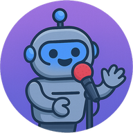

#  RoboComic

RoboComic is an AI-powered standup comedy duel app where virtual comedians battle it out with jokes, roasts, and text-to-speech performances. Users can generate comedy duels and listen to jokes.

[](https://robo-comic.vercel.app)


**Frontend:**  
[](https://snyk.io/test/github/lukuch/RoboComic?targetFile=frontend/package.json)  
**Backend:**  
[](https://snyk.io/test/github/lukuch/RoboComic?targetFile=backend/requirements.txt)

## Features
- Generate AI-powered standup comedy duels with agent orchestration (AutoGen)
- Choose from multiple comedian personas and styles
- Listen to jokes with text-to-speech (TTS) playback
- Enjoy bilingual (English & Polish) support with full internationalization
- Install as a Progressive Web App (PWA) on desktop and mobile
- Use a modern and responsive UI
- Easily extend the backend with new TTS providers or AI agents
- Benefit from a modular architecture with clean separation of backend services, models, and utilities
- Automated dependency management for backend (Poetry) and frontend (npm)
- CI/CD with automated testing, linting, formatting, and security checks via GitHub Actions
- Production-ready Dockerfile for backend deployment
- Pre-commit hooks for code quality and requirements synchronization
- Optional LangSmith tracing for LLM/agent calls (see environment variables)

## Supabase Integration

RoboComic uses [Supabase](https://supabase.com/) for several key frontend features:

- User authentication (email/password and Google sign-in)
- User show history (persisted across sessions and devices)
- Persistent TTS storage for generated audio

## Customization

- **Add new comedian personas or styles:**
  - Edit or add entries in `backend/config/personas.py`.
  - Each persona can have a unique description, style, and language support.
- **Add new TTS providers or AI agents:**
  - Implement a new service in `backend/tts/` or `backend/agents/`.
  - Register new services in `backend/container.py`.
  - The backend uses the `injector` library for Inversion of Control (IoC) to manage dependencies and service injection.

## Technologies Used
- **Frontend:** Next.js 15, React 19, Tailwind CSS 3.4+, next-pwa, TypeScript, Supabase, Jest, React Testing Library
- **Backend:** FastAPI (Python 3.11+), AutoGen (agent orchestration), TTS services (e.g., ElevenLabs), LangChain (LLM orchestration), LangSmith, slowapi, tenacity, structlog, injector
- **Other:** Service Workers, PWA Manifest, Docker, GitHub Actions, Dependabot, Codecov, Gitleaks

## Getting Started

### Prerequisites
- Node.js (v16+ recommended)
- Python 3.11+

### Setup
1. **Clone the repository:**
   ```bash
   git clone https://github.com/lukuch/RoboComic.git
   cd RoboComic
   ```
2. **Backend:**
   The backend uses [Poetry](https://python-poetry.org/) for dependency management.
   Before installing dependencies, set up your environment variables:
   - Copy `.env.example` to `.env` in the `backend` directory.
   - Fill in all required values (e.g., API keys for ElevenLabs, OpenAI).

   Example `.env`:
   ```env
   OPENAI_API_KEY=your-openai-api-key-here
   ELEVENLABS_API_KEY=your-elevenlabs-api-key-here

   # Voice IDs for comedians (from ElevenLabs)
   COMEDIAN1_VOICE_ID=your-voice-id-1
   COMEDIAN2_VOICE_ID=your-voice-id-2

   # LLM model (use gpt-4o for optimal performance; previous models may make mistakes even with correct prompting)
   LLM_MODEL=gpt-4o

   # If you want to enable LangSmith tracing for LLM/agent orchestration, set the following variables:
   LANGSMITH_TRACING=true
   LANGSMITH_ENDPOINT="https://api.smith.langchain.com"
   LANGSMITH_API_KEY="<your-api-key>"
   LANGSMITH_PROJECT="robo-comic"
   ```

   If you don't have Poetry installed, run the following:
   ```bash
   pip install poetry
   ```
   Then, to install dependencies and run the API server (default port 8000):
   ```bash
   cd backend
   poetry install
   poetry run python main.py api
   ```
   > **Note:** The `api` argument is required. If omitted, the Streamlit app will run instead of the API server.
3. **Frontend:**
   Add a `.env.local` file in the `frontend` directory with your Supabase credentials:

   ```env
   NEXT_PUBLIC_SUPABASE_URL=https://your-supabase-url.supabase.co
   NEXT_PUBLIC_SUPABASE_ANON_KEY=your-supabase-anon-key
   ```

   These are required for the app to connect to your Supabase project for authentication, storage, and user data.
   To install dependencies and start the development server (default port 3000):
   ```bash
   cd frontend
   npm install
   npm run dev
   ```
4. **Access the app:**
   - Open [http://localhost:3000](http://localhost:3000) in your browser.

### Production Build
- Frontend: `npm run build && npm start`
- Backend: Run with a production uvicorn server or use the provided Dockerfile:
  ```bash
  cd backend
  docker build -t robocomic-backend:latest .
  docker run -p 8000:8000 robocomic-backend:latest
  ```

## Automation & Quality
- **Dependabot:** Automated dependency updates for both backend and frontend
- **Pre-commit hooks:** Formatting (Black), import sorting (isort), linting (flake8), requirements export (Poetry), frontend lint (ESLint), Prettier formatting, and TypeScript type checks
- **CI/CD:**
  - Linting, formatting, and type checks for both backend and frontend
  - Automated tests with coverage (Codecov)
  - Security scanning (Snyk, Trivy, Gitleaks)
  - Docker build validation (with non-root user and healthcheck)
  - Bundle size analysis (with @next/bundle-analyzer)
  - Render cloud deployment via GitHub Actions

## PWA Installation
- Visit the app in Chrome, Edge, or Safari.
- Click the install icon in the address bar or use "Add to Home Screen" on mobile.
- Enjoy RoboComic as a native-like app!

## Troubleshooting

### TTS Issues
**Text-to-Speech not working:**
- Verify ElevenLabs API key is valid
- Check voice IDs exist in your ElevenLabs account
- Ensure internet connection for API calls
- **Free plan users:** You may have run out of monthly credits — check your ElevenLabs dashboard

## Project Structure (and crucial files)
```
RoboComic/
  backend/                        # FastAPI backend, TTS services, AutoGen orchestration
    main.py                       # Entry point for API/Streamlit
    container.py                  # Dependency injection setup (injector)
    config/
      personas.py                 # Comedian persona definitions
      settings.py                 # Environment variables and config
      translations.py             # Translation/internationalization support
    agents/
      comedian_agent.py           # Comedian agent implementation
    services/
      agent_manager.py            # Agent orchestration management
      api_service.py              # API service layer
      llm_service.py              # LLM service (LangChain, prompt orchestration)
      prompt_templates.py         # Prompt templates for LLMs
    models/
      api_models.py               # API request/response models
    tts/
      tts_service.py              # TTS service base/utility
      eleven_tts_service.py       # ElevenLabs TTS service
      bark_tts_service.py         # Bark TTS service
    utils/                        # Error handling, logging, exceptions
      error_handler.py
      exceptions.py
      logger.py
      resilience.py
    ui/
      streamlit_ui.py             # Streamlit app (optional)
      style.css                   # Streamlit UI styles
    tests/
      test_api_endpoints.py       # API endpoint tests
      test_integration.py         # Integration tests
      test_models.py              # Model tests
      test_services.py            # Service tests
      test_utils.py               # Utility tests
      conftest.py                 # Pytest fixtures
    Dockerfile                    # Production Dockerfile
    .flake8                       # Flake8 config
    pyproject.toml                # Poetry and tool config
    requirements.txt              # Exported requirements

  frontend/                       # Next.js frontend, PWA config, UI
    __tests__/                    # Jest/React Testing Library tests
      Home.test.tsx
      ShowForm.test.tsx
      ShowHistory.test.tsx
    app/
      layout.tsx                  # Root layout and metadata
      page.tsx                    # Main page
      Home/                       # Home page components
        AppHeader.tsx
        ErrorDisplay.tsx
        Footer.tsx                # App footer
        LanguageSelector.tsx
        LoadingOverlay.tsx
        translations.ts
        index.tsx                 # Home page main component
      reset-password/
        page.tsx                  # Password reset page
      page.module.css
      globals.css
    components/
      Auth/
        AuthForm.tsx
      shared/
        Tooltip.tsx               # Shared tooltip component
      ShowForm/                   # Show generation form
        CheckboxWithTooltip.tsx
        ComedianSelector.tsx
        FormInput.tsx
        FormLabel.tsx
        NumberInput.tsx
        SubmitButton.tsx
        TemperatureConfig.tsx
        index.tsx                 # Show form main component
      ShowHistory/                # Show history display
        Avatar.tsx
        ChatBubble.tsx
        ChatBubble.css
        CustomAudioPlayer.tsx
        ManagerBubble.tsx
        TTSButton.tsx
        WinnerSummary.tsx
        JudgingSection.tsx
        SkeletonBubble.tsx
        index.tsx                 # Show history main component
      UserShowHistorySidebar/
        index.tsx
    hooks/
      useShowGeneration.ts        # Show generation hook
      useKeepAlive.ts             # Keep-alive hook
      useLanguage.ts              # Language management hook
      usePersonas.ts              # Persona management hook
      usePersonaSelection.ts      # Persona selection hook
      useTheme.ts                 # Theme management hook
    services/
      apiService.ts               # API service layer
    utils/
      stringUtils.ts              # String case utility functions
      supabaseClient.ts           # Supabase client
    constants/
      index.ts                    # App constants
    types/
      index.ts                    # TypeScript type definitions
      next-pwa.d.ts               # PWA type definitions
    public/
      manifest.json               # PWA manifest
      icon-192x192.png            # PWA icons
      icon-512x512.png
      sw.js                       # Service worker
      favicon.ico
    next.config.ts                # Next.js config
    tailwind.config.js            # Tailwind CSS config
    tsconfig.json                 # TypeScript config
    postcss.config.js             # PostCSS config
    package.json                  # NPM dependencies and scripts
    package-lock.json
    vercel.json                   # Vercel deployment config

  .pre-commit-config.yaml         # Pre-commit hooks configuration

.github/
  workflows/
    ci.yml                        # Full CI/CD pipeline
    quick-test.yml                # Fast test workflow
    render-deploy.yml             # Render cloud deployment workflow
  dependabot.yml                  # Automated dependency updates

LICENSE
README.md
```

## License

This project is licensed under the MIT License. You are free to use, modify, and distribute it.

## Author
Created by lukuch (Łukasz Ucher)

---
Enjoy the show! 🤖🎤

